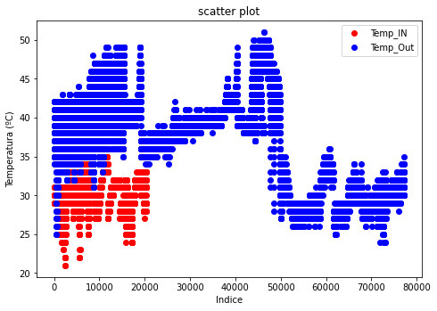
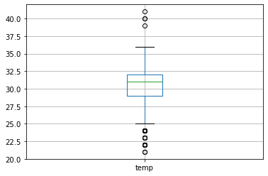
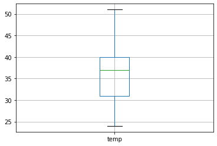
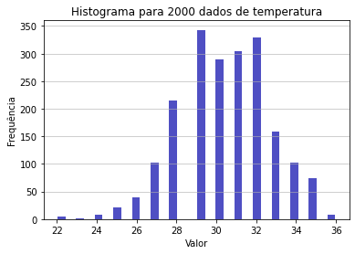
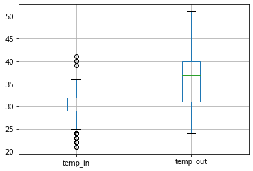
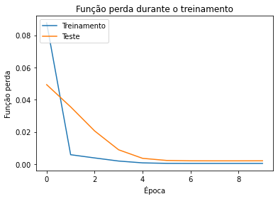
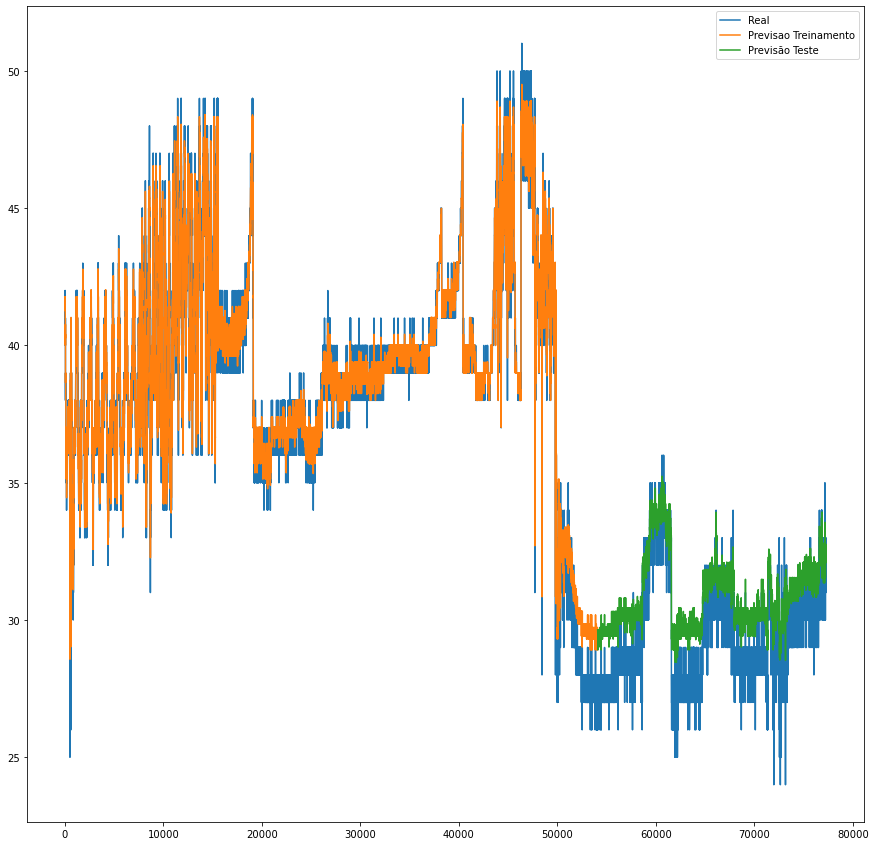

# Bootcamp: Arquiteto(a) de Machine Learning

## Trabalho Prático
**Módulo 4: Aplicações de Aprendizado de Máquina Para IoT**

## Objetivos de Ensino
**Exercitar os seguintes conceitos trabalhados no Módulo:**


1. Identificação de anomalias.
2. Tratamento do dataset.
3. Conhecendo o dataset.
4. Utilizar modelos de previsão para séries temporais.

## Enunciado

**Atualmente, a IoT é um dos principais elementos responsáveis pela geração
de dados e troca de informação existente em nosso planeta. Dessa forma,
conhecendo as características dos dispositivos IoT (reduzida disponibilidade
de recursos), é natural que os dados gerados por esses dispositivos
contenham diferentes tipos de anomalias (dados faltosos, errados e outliers).
Portanto, é necessário realizar um processamento cuidadoso desses dados
antes de aplicar qualquer um dos modelos de aprendizado de máquina.
Imagine um cenário em que se deseja realizar a previsão de temperatura em
uma residência a partir de dados históricos coletados por diferentes sensores.
Nesse cenário, realizar o pré-processamento é fundamental.
Essa previsão de temperatura pode ser utilizada, por exemplo, para a
construção de um sistema que seja capaz de prever e ajustar a temperatura
do ambiente. Quando esse ajuste ocorre de maneira eficiente, os atuadores
(ar-condicionado e aquecedores) passam a funcionar de maneira harmônica,
o que proporciona maior conforto aos residentes e uma maior economia de
energia.** 

**Previsão de temperatura**


```python
#importando os módulos a serem utilizados
import pandas as pd                                   #utilizado para a construção os dataframes e análise exploratória
import numpy as np                                    #utilizado para a operações vetoriais e matriciais
import matplotlib.pyplot as plt                       #utilizado para construção de gráficos
from sklearn.linear_model import LinearRegression     #utilizada para a construção do modelo de regressão linear
```


```python
#importando os dados
IOT_temp = pd.read_csv("IOT-temp.csv")
```


```python
#conhecendo o dataset
IOT_temp.head(5)
```


<div>

<table border="1" class="dataframe">
  <thead>
    <tr style="text-align: right;">
      <th></th>
      <th>id</th>
      <th>room_id/id</th>
      <th>noted_date</th>
      <th>temp</th>
      <th>out/in</th>
    </tr>
  </thead>
  <tbody>
    <tr>
      <th>0</th>
      <td>__export__.temp_log_196134_bd201015</td>
      <td>Room Admin</td>
      <td>08-12-2018 09:30</td>
      <td>29</td>
      <td>In</td>
    </tr>
    <tr>
      <th>1</th>
      <td>__export__.temp_log_196131_7bca51bc</td>
      <td>Room Admin</td>
      <td>08-12-2018 09:30</td>
      <td>29</td>
      <td>In</td>
    </tr>
    <tr>
      <th>2</th>
      <td>__export__.temp_log_196127_522915e3</td>
      <td>Room Admin</td>
      <td>08-12-2018 09:29</td>
      <td>41</td>
      <td>Out</td>
    </tr>
    <tr>
      <th>3</th>
      <td>__export__.temp_log_196128_be0919cf</td>
      <td>Room Admin</td>
      <td>08-12-2018 09:29</td>
      <td>41</td>
      <td>Out</td>
    </tr>
    <tr>
      <th>4</th>
      <td>__export__.temp_log_196126_d30b72fb</td>
      <td>Room Admin</td>
      <td>08-12-2018 09:29</td>
      <td>31</td>
      <td>In</td>
    </tr>
  </tbody>
</table>
</div>


*Mostrando os dados*


1.   id -> identificador único para cada medida.
2.   room_id/id -> id do local onde o dispositivo foi instalado
3.   noted_date -> data da leitura
4.   temp -> valor da temperatura medida
5.   out/in -> indica se o dispositivo foi instalado no ambiente interno(in) ou no ambiente externo (out) 


```python
#conhecendo as características dos dados
IOT_temp.info()
```

    <class 'pandas.core.frame.DataFrame'>
    RangeIndex: 97606 entries, 0 to 97605
    Data columns (total 5 columns):
     #   Column      Non-Null Count  Dtype 
    ---  ------      --------------  ----- 
     0   id          97606 non-null  object
     1   room_id/id  97606 non-null  object
     2   noted_date  97606 non-null  object
     3   temp        97606 non-null  int64 
     4   out/in      97606 non-null  object
    dtypes: int64(1), object(4)
    memory usage: 3.7+ MB
    

**Quantos tipos de dados distintos existem?**


```python
IOT_temp.dtypes.array.unique()
```


    <PandasArray>
    [dtype('O'), dtype('int64')]
    Length: 2, dtype: object


**Quantos valores nulos existem?**


```python
IOT_temp.isnull().sum()
```


    id            0
    room_id/id    0
    noted_date    0
    temp          0
    out/in        0
    dtype: int64


```python
#obtendo as estatísticas descritivas do dataset
IOT_temp.describe()
```


<div>

<table border="1" class="dataframe">
  <thead>
    <tr style="text-align: right;">
      <th></th>
      <th>temp</th>
    </tr>
  </thead>
  <tbody>
    <tr>
      <th>count</th>
      <td>97606.000000</td>
    </tr>
    <tr>
      <th>mean</th>
      <td>35.053931</td>
    </tr>
    <tr>
      <th>std</th>
      <td>5.699825</td>
    </tr>
    <tr>
      <th>min</th>
      <td>21.000000</td>
    </tr>
    <tr>
      <th>25%</th>
      <td>30.000000</td>
    </tr>
    <tr>
      <th>50%</th>
      <td>35.000000</td>
    </tr>
    <tr>
      <th>75%</th>
      <td>40.000000</td>
    </tr>
    <tr>
      <th>max</th>
      <td>51.000000</td>
    </tr>
  </tbody>
</table>
</div>


**Qual é a mediana das temperaturas medidas?**


```python
IOT_temp.temp.median()
```


    35.0


```python
#Contando quantos valores de temperaturas são In ou Out
IOT_temp.groupby("out/in").count()['id']
```


    out/in
    In     20345
    Out    77261
    Name: id, dtype: int64


**Qual é o percentual dos dados de temperaturas coletados no ambiente externo (out)?**


```python
round(IOT_temp['out/in'].value_counts(normalize=True)*100)
```


    Out    79.0
    In     21.0
    Name: out/in, dtype: float64


```python
#separando o dataset entre valores de In e Out
df_in=IOT_temp[IOT_temp["out/in"]=="In"].reset_index()
df_out=IOT_temp[IOT_temp["out/in"]=="Out"].reset_index()
df_out.head(5)
```


<div>

<table border="1" class="dataframe">
  <thead>
    <tr style="text-align: right;">
      <th></th>
      <th>index</th>
      <th>id</th>
      <th>room_id/id</th>
      <th>noted_date</th>
      <th>temp</th>
      <th>out/in</th>
    </tr>
  </thead>
  <tbody>
    <tr>
      <th>0</th>
      <td>2</td>
      <td>__export__.temp_log_196127_522915e3</td>
      <td>Room Admin</td>
      <td>08-12-2018 09:29</td>
      <td>41</td>
      <td>Out</td>
    </tr>
    <tr>
      <th>1</th>
      <td>3</td>
      <td>__export__.temp_log_196128_be0919cf</td>
      <td>Room Admin</td>
      <td>08-12-2018 09:29</td>
      <td>41</td>
      <td>Out</td>
    </tr>
    <tr>
      <th>2</th>
      <td>10</td>
      <td>__export__.temp_log_196108_4a983c7e</td>
      <td>Room Admin</td>
      <td>08-12-2018 09:25</td>
      <td>42</td>
      <td>Out</td>
    </tr>
    <tr>
      <th>3</th>
      <td>11</td>
      <td>__export__.temp_log_196108_4a983c7e</td>
      <td>Room Admin</td>
      <td>08-12-2018 09:25</td>
      <td>42</td>
      <td>Out</td>
    </tr>
    <tr>
      <th>4</th>
      <td>16</td>
      <td>__export__.temp_log_196094_38501388</td>
      <td>Room Admin</td>
      <td>08-12-2018 09:21</td>
      <td>41</td>
      <td>Out</td>
    </tr>
  </tbody>
</table>
</div>


```python
#plotando os valores (sempre bom...)
plt.figure(figsize=(10,10))  #define o tamanho da figura
fig=plt.figure()
ax=fig.add_axes([0,0,1,1])
ax.scatter(df_in.index, df_in.temp, color='r')
ax.scatter(df_out.index, df_out.temp, color='b')
ax.set_xlabel('Indice')
ax.set_ylabel('Temperatura (ºC)')
ax.legend(["Temp_IN", "Temp_Out"])
ax.set_title('scatter plot')
plt.show()
```


    <Figure size 720x720 with 0 Axes>


    

    


```python
#identificando possíveis outliers por meio do boxplot das temperaturas internas
df_in.boxplot("temp");
```


    

    


```python
#identificando possíveis outliers por meio do boxplot das temperaturas externas
df_out.boxplot("temp");
```


    

    


**Sobre o boxplot dos dados de temperatura interna(in) e externa(out), o que podemos dizer sobre os possíveis outliers?**

**R. Temos possíveis outliers para as temperaturas internas e não identificamos possíveis outliers para as temperaturas externas.**


```python
#verificando se os dados internos possuem uma distribuição normal por meio do histograma
temperatura=df_in.sample(n=2000,random_state=32)['temp']            #selecionando 2000 amostra dos dados 
```


```python
temperatura
```


    12691    30
    9806     29
    14954    28
    1986     24
    18775    32
             ..
    526      29
    5413     31
    281      29
    20054    29
    11915    28
    Name: temp, Length: 2000, dtype: int64


```python
n, bins, patches = plt.hist(x=temperatura, bins='auto', color='#0504aa',
                            alpha=0.7, rwidth=0.85)
plt.grid(axis='y', alpha=0.75)
plt.xlabel('Valor')
plt.ylabel('Frequência')
plt.title('Histograma para 2000 dados de temperatura');
```


    

    


```python
#utilizando o teste de D’Agostino’s Test para verificar a normalidade dos dados de temperatura
from scipy.stats import normaltest                                      #módulo utilizado para a realização do teste de normalidade 
f_valor, p_valor = normaltest(temperatura)                              #aplica o teste sobre os dados
print('f-valor=%.3f, p-valor=%.3f' % (f_valor, p_valor))
alpha = 0.05                                                         #nível de significância
if p_valor > alpha:
	print('Não rejeita H0')
else:
	print('Rejeita H0')
```

    f-valor=3.881, p-valor=0.144
    Não rejeita H0
    

**Analisando o histograma e o resultado do teste, o que podemos falar sobre a normalidade dos dados?**

**O resultado do teste de normalidade indica que os dados de temperatura coletados no ambiente interno seguem uma distribuição normal, isso fortalece a hipótese de que esses dados podem ser modelados por uma distribuição normal e permite o uso de técnicas estatísticas que exigem a normalidade dos dados, como testes de hipótese e análises de correlação.**


```python
#modificando o tipo dos dados de data para o dataset das temperaturas de entrada
df_in['noted_date']= pd.to_datetime(df_in['noted_date'],errors='coerce') 
df_in.info()
```

    <class 'pandas.core.frame.DataFrame'>
    RangeIndex: 20345 entries, 0 to 20344
    Data columns (total 6 columns):
     #   Column      Non-Null Count  Dtype         
    ---  ------      --------------  -----         
     0   index       20345 non-null  int64         
     1   id          20345 non-null  object        
     2   room_id/id  20345 non-null  object        
     3   noted_date  20345 non-null  datetime64[ns]
     4   temp        20345 non-null  int64         
     5   out/in      20345 non-null  object        
    dtypes: datetime64[ns](1), int64(2), object(3)
    memory usage: 953.8+ KB
    

**Quantos tipos de dados existem agora no df_in?**


```python
df_in.dtypes.array.unique()
```


    <PandasArray>
    [dtype('int64'), dtype('O'), dtype('<M8[ns]')]
    Length: 3, dtype: object


**Após a transformação do tipo de dados, foram introduzidos valores nulos?**


```python
df_in.isnull().sum()
```


    index         0
    id            0
    room_id/id    0
    noted_date    0
    temp          0
    out/in        0
    dtype: int64


```python
#ordenando o dataset
df_in=df_in.sort_values(by=['noted_date'])
df_in.head()
```


<div>

<table border="1" class="dataframe">
  <thead>
    <tr style="text-align: right;">
      <th></th>
      <th>index</th>
      <th>id</th>
      <th>room_id/id</th>
      <th>noted_date</th>
      <th>temp</th>
      <th>out/in</th>
    </tr>
  </thead>
  <tbody>
    <tr>
      <th>3545</th>
      <td>16218</td>
      <td>__export__.temp_log_126924_cb744837</td>
      <td>Room Admin</td>
      <td>2018-01-11 00:06:00</td>
      <td>32</td>
      <td>In</td>
    </tr>
    <tr>
      <th>3544</th>
      <td>16186</td>
      <td>__export__.temp_log_128828_1f2ca69c</td>
      <td>Room Admin</td>
      <td>2018-01-11 02:12:00</td>
      <td>32</td>
      <td>In</td>
    </tr>
    <tr>
      <th>3543</th>
      <td>16176</td>
      <td>__export__.temp_log_142141_12bd7384</td>
      <td>Room Admin</td>
      <td>2018-01-11 02:44:00</td>
      <td>32</td>
      <td>In</td>
    </tr>
    <tr>
      <th>3542</th>
      <td>16174</td>
      <td>__export__.temp_log_106858_cdf61926</td>
      <td>Room Admin</td>
      <td>2018-01-11 02:46:00</td>
      <td>32</td>
      <td>In</td>
    </tr>
    <tr>
      <th>3541</th>
      <td>16167</td>
      <td>__export__.temp_log_120068_a0fc57cc</td>
      <td>Room Admin</td>
      <td>2018-01-11 02:58:00</td>
      <td>31</td>
      <td>In</td>
    </tr>
  </tbody>
</table>
</div>


```python
#aplicando o reset de index
df_in.reset_index(drop=True)
```


<div>

<table border="1" class="dataframe">
  <thead>
    <tr style="text-align: right;">
      <th></th>
      <th>index</th>
      <th>id</th>
      <th>room_id/id</th>
      <th>noted_date</th>
      <th>temp</th>
      <th>out/in</th>
    </tr>
  </thead>
  <tbody>
    <tr>
      <th>0</th>
      <td>16218</td>
      <td>__export__.temp_log_126924_cb744837</td>
      <td>Room Admin</td>
      <td>2018-01-11 00:06:00</td>
      <td>32</td>
      <td>In</td>
    </tr>
    <tr>
      <th>1</th>
      <td>16186</td>
      <td>__export__.temp_log_128828_1f2ca69c</td>
      <td>Room Admin</td>
      <td>2018-01-11 02:12:00</td>
      <td>32</td>
      <td>In</td>
    </tr>
    <tr>
      <th>2</th>
      <td>16176</td>
      <td>__export__.temp_log_142141_12bd7384</td>
      <td>Room Admin</td>
      <td>2018-01-11 02:44:00</td>
      <td>32</td>
      <td>In</td>
    </tr>
    <tr>
      <th>3</th>
      <td>16174</td>
      <td>__export__.temp_log_106858_cdf61926</td>
      <td>Room Admin</td>
      <td>2018-01-11 02:46:00</td>
      <td>32</td>
      <td>In</td>
    </tr>
    <tr>
      <th>4</th>
      <td>16167</td>
      <td>__export__.temp_log_120068_a0fc57cc</td>
      <td>Room Admin</td>
      <td>2018-01-11 02:58:00</td>
      <td>31</td>
      <td>In</td>
    </tr>
    <tr>
      <th>...</th>
      <td>...</td>
      <td>...</td>
      <td>...</td>
      <td>...</td>
      <td>...</td>
      <td>...</td>
    </tr>
    <tr>
      <th>20340</th>
      <td>50723</td>
      <td>__export__.temp_log_41083_917dc7ae</td>
      <td>Room Admin</td>
      <td>2018-12-10 20:25:00</td>
      <td>35</td>
      <td>In</td>
    </tr>
    <tr>
      <th>20341</th>
      <td>50721</td>
      <td>__export__.temp_log_41090_c0ed0bd1</td>
      <td>Room Admin</td>
      <td>2018-12-10 20:35:00</td>
      <td>34</td>
      <td>In</td>
    </tr>
    <tr>
      <th>20342</th>
      <td>50720</td>
      <td>__export__.temp_log_41091_8546ae99</td>
      <td>Room Admin</td>
      <td>2018-12-10 20:37:00</td>
      <td>35</td>
      <td>In</td>
    </tr>
    <tr>
      <th>20343</th>
      <td>50706</td>
      <td>__export__.temp_log_41129_77d8da57</td>
      <td>Room Admin</td>
      <td>2018-12-10 21:31:00</td>
      <td>34</td>
      <td>In</td>
    </tr>
    <tr>
      <th>20344</th>
      <td>50705</td>
      <td>__export__.temp_log_41130_13e2eff7</td>
      <td>Room Admin</td>
      <td>2018-12-10 21:33:00</td>
      <td>35</td>
      <td>In</td>
    </tr>
  </tbody>
</table>
<p>20345 rows × 6 columns</p>
</div>


```python
#aplicando o mesmo procedimento para o dataframe de out
#modificando o tipo de dados 
df_out['noted_date']= pd.to_datetime(df_out['noted_date']) 
df_out=df_out.sort_values(by=['noted_date'])
df_out.reset_index(drop=True)
```


<div>

<table border="1" class="dataframe">
  <thead>
    <tr style="text-align: right;">
      <th></th>
      <th>index</th>
      <th>id</th>
      <th>room_id/id</th>
      <th>noted_date</th>
      <th>temp</th>
      <th>out/in</th>
    </tr>
  </thead>
  <tbody>
    <tr>
      <th>0</th>
      <td>16217</td>
      <td>__export__.temp_log_146101_e61c18d4</td>
      <td>Room Admin</td>
      <td>2018-01-11 00:07:00</td>
      <td>40</td>
      <td>Out</td>
    </tr>
    <tr>
      <th>1</th>
      <td>16216</td>
      <td>__export__.temp_log_111262_7b3ed086</td>
      <td>Room Admin</td>
      <td>2018-01-11 00:09:00</td>
      <td>39</td>
      <td>Out</td>
    </tr>
    <tr>
      <th>2</th>
      <td>16215</td>
      <td>__export__.temp_log_147650_344507e9</td>
      <td>Room Admin</td>
      <td>2018-01-11 00:13:00</td>
      <td>40</td>
      <td>Out</td>
    </tr>
    <tr>
      <th>3</th>
      <td>16214</td>
      <td>__export__.temp_log_139505_cd77d7f9</td>
      <td>Room Admin</td>
      <td>2018-01-11 00:23:00</td>
      <td>40</td>
      <td>Out</td>
    </tr>
    <tr>
      <th>4</th>
      <td>16213</td>
      <td>__export__.temp_log_127981_32c85db7</td>
      <td>Room Admin</td>
      <td>2018-01-11 00:25:00</td>
      <td>40</td>
      <td>Out</td>
    </tr>
    <tr>
      <th>...</th>
      <td>...</td>
      <td>...</td>
      <td>...</td>
      <td>...</td>
      <td>...</td>
      <td>...</td>
    </tr>
    <tr>
      <th>77256</th>
      <td>50668</td>
      <td>__export__.temp_log_41241_36e995ef</td>
      <td>Room Admin</td>
      <td>2018-12-10 23:41:00</td>
      <td>44</td>
      <td>Out</td>
    </tr>
    <tr>
      <th>77257</th>
      <td>50667</td>
      <td>__export__.temp_log_41244_1cef6363</td>
      <td>Room Admin</td>
      <td>2018-12-10 23:43:00</td>
      <td>44</td>
      <td>Out</td>
    </tr>
    <tr>
      <th>77258</th>
      <td>50666</td>
      <td>__export__.temp_log_41249_7d6819cd</td>
      <td>Room Admin</td>
      <td>2018-12-10 23:49:00</td>
      <td>44</td>
      <td>Out</td>
    </tr>
    <tr>
      <th>77259</th>
      <td>50665</td>
      <td>__export__.temp_log_41250_eed95540</td>
      <td>Room Admin</td>
      <td>2018-12-10 23:51:00</td>
      <td>45</td>
      <td>Out</td>
    </tr>
    <tr>
      <th>77260</th>
      <td>50664</td>
      <td>__export__.temp_log_41254_5b6ff69c</td>
      <td>Room Admin</td>
      <td>2018-12-10 23:55:00</td>
      <td>44</td>
      <td>Out</td>
    </tr>
  </tbody>
</table>
<p>77261 rows × 6 columns</p>
</div>


```python
print("Registros existentes no df_IN: ",df_in.count()[0])
print("Registros existentes no df_OUt: ",df_out.count()[0])
```

    Registros existentes no df_IN:  20345
    Registros existentes no df_OUt:  77261
    


```python
#comparando as duas temperaturas "estatísticamente"
frame = { 'temp_in': df_in.temp, 'temp_out': df_out.temp } 
df_in_out=pd.DataFrame(frame)
df_in_out.head()
```


<div>

<table border="1" class="dataframe">
  <thead>
    <tr style="text-align: right;">
      <th></th>
      <th>temp_in</th>
      <th>temp_out</th>
    </tr>
  </thead>
  <tbody>
    <tr>
      <th>0</th>
      <td>29.0</td>
      <td>41</td>
    </tr>
    <tr>
      <th>1</th>
      <td>29.0</td>
      <td>41</td>
    </tr>
    <tr>
      <th>2</th>
      <td>31.0</td>
      <td>42</td>
    </tr>
    <tr>
      <th>3</th>
      <td>31.0</td>
      <td>42</td>
    </tr>
    <tr>
      <th>4</th>
      <td>29.0</td>
      <td>41</td>
    </tr>
  </tbody>
</table>
</div>


```python
#mostrando os dados
df_in_out.info()
```

    <class 'pandas.core.frame.DataFrame'>
    Int64Index: 77261 entries, 0 to 77260
    Data columns (total 2 columns):
     #   Column    Non-Null Count  Dtype  
    ---  ------    --------------  -----  
     0   temp_in   20345 non-null  float64
     1   temp_out  77261 non-null  int64  
    dtypes: float64(1), int64(1)
    memory usage: 1.8 MB
    


```python
#exemplificando o pivot
table = pd.pivot_table(IOT_temp, values='temp', index=['noted_date'], columns= ["out/in"],fill_value=0)
table
```


<div>

<table border="1" class="dataframe">
  <thead>
    <tr style="text-align: right;">
      <th>out/in</th>
      <th>In</th>
      <th>Out</th>
    </tr>
    <tr>
      <th>noted_date</th>
      <th></th>
      <th></th>
    </tr>
  </thead>
  <tbody>
    <tr>
      <th>01-11-2018 00:06</th>
      <td>32.0</td>
      <td>0.0</td>
    </tr>
    <tr>
      <th>01-11-2018 00:07</th>
      <td>0.0</td>
      <td>40.0</td>
    </tr>
    <tr>
      <th>01-11-2018 00:09</th>
      <td>0.0</td>
      <td>39.0</td>
    </tr>
    <tr>
      <th>01-11-2018 00:13</th>
      <td>0.0</td>
      <td>40.0</td>
    </tr>
    <tr>
      <th>01-11-2018 00:23</th>
      <td>0.0</td>
      <td>40.0</td>
    </tr>
    <tr>
      <th>...</th>
      <td>...</td>
      <td>...</td>
    </tr>
    <tr>
      <th>31-10-2018 23:52</th>
      <td>0.0</td>
      <td>40.0</td>
    </tr>
    <tr>
      <th>31-10-2018 23:53</th>
      <td>0.0</td>
      <td>39.0</td>
    </tr>
    <tr>
      <th>31-10-2018 23:54</th>
      <td>32.0</td>
      <td>0.0</td>
    </tr>
    <tr>
      <th>31-10-2018 23:55</th>
      <td>0.0</td>
      <td>40.0</td>
    </tr>
    <tr>
      <th>31-10-2018 23:57</th>
      <td>0.0</td>
      <td>39.0</td>
    </tr>
  </tbody>
</table>
<p>27920 rows × 2 columns</p>
</div>


```python
#comparando a igualdade dos valores In e Out
df_in_out.boxplot();
```


    

    


**Analisando o boxplot da temp_in e temp_out, o que é possível afirmar?**

**R. Existe uma maior dispersão nos dados de temperatura externa.**


```python
#criando um modelo de previsão de temperatura 
df_out_new=IOT_temp[IOT_temp["out/in"]=="Out"]["temp"].values
```


```python
#normaliza os dados
from sklearn.preprocessing import MinMaxScaler
scaler = MinMaxScaler(feature_range=(0, 1))
serie_out = scaler.fit_transform(df_out_new.reshape(-1, 1))
```


```python
serie_out
```


    array([[0.62962963],
           [0.62962963],
           [0.66666667],
           ...,
           [0.2962963 ],
           [0.2962963 ],
           [0.2962963 ]])


```python
#define a quantidade de dados para treinamento e teste
train=serie_out[:int(len(serie_out)*0.7)]      #70% inicial para o treinamento
test=serie_out[int(len(serie_out)*0.7):]       #30% final para o teste
```


```python
#método para colcoar os dados de entrada em um formato necessário para a previsão
#define o intervalo a ser utilizado para entrada da rede neural recorrente LSTM
def create_dataset(dataset, look_back=1):
    dataX, dataY = [], []
    for i in range(len(dataset)-look_back-1):
        a = dataset[i:(i+look_back), 0]
        dataX.append(a)
        dataY.append(dataset[i + look_back, 0])
    return np.array(dataX), np.array(dataY)
```


```python
look_back = 3                                           # quantidade de passos para a autocorrelação
trainX, trainY = create_dataset(train, look_back)
testX, testY = create_dataset(test, look_back)
```


```python
#colocando os dados no formato para entrada na rede LSTM  [amostras, time steps, features]
trainX = np.reshape(trainX, (trainX.shape[0], look_back, 1))
testX = np.reshape(testX, (testX.shape[0], look_back, 1))
```


```python
#definindo o modelo para a rede neural recorrente LSTM
from tensorflow.keras.models import Sequential              #utilizando o modelo sequencial para a construção da rede
from tensorflow.keras.layers import Dense, Flatten, LSTM    #utilizado para definir as camadas a serem utilizadas

```


```python
#definindo o modelo
model = Sequential()
model.add(LSTM(4, input_shape=(look_back,1)))
model.add(Dense(1))
model.compile(loss='mean_squared_error', optimizer='adam')
```


```python
#mostra o modelo
model.summary()
```

    Model: "sequential"
    _________________________________________________________________
     Layer (type)                Output Shape              Param #   
    =================================================================
     lstm (LSTM)                 (None, 4)                 96        
                                                                     
     dense (Dense)               (None, 1)                 5         
                                                                     
    =================================================================
    Total params: 101
    Trainable params: 101
    Non-trainable params: 0
    _________________________________________________________________
    

**Sobre a rede LSTM criada, o que é correto dizer?**


```python
#Treina o modelo
historico=model.fit(trainX, trainY, validation_split=0.2,epochs=10, batch_size=100, verbose=2)
```

    Epoch 1/10
    433/433 - 6s - loss: 0.0877 - val_loss: 0.0493 - 6s/epoch - 13ms/step
    Epoch 2/10
    433/433 - 2s - loss: 0.0058 - val_loss: 0.0355 - 2s/epoch - 4ms/step
    Epoch 3/10
    433/433 - 2s - loss: 0.0038 - val_loss: 0.0206 - 2s/epoch - 3ms/step
    Epoch 4/10
    433/433 - 1s - loss: 0.0019 - val_loss: 0.0089 - 1s/epoch - 3ms/step
    Epoch 5/10
    433/433 - 1s - loss: 7.7930e-04 - val_loss: 0.0036 - 1s/epoch - 3ms/step
    Epoch 6/10
    433/433 - 1s - loss: 4.7766e-04 - val_loss: 0.0023 - 1s/epoch - 3ms/step
    Epoch 7/10
    433/433 - 2s - loss: 4.4757e-04 - val_loss: 0.0021 - 2s/epoch - 3ms/step
    Epoch 8/10
    433/433 - 2s - loss: 4.4677e-04 - val_loss: 0.0020 - 2s/epoch - 3ms/step
    Epoch 9/10
    433/433 - 2s - loss: 4.4597e-04 - val_loss: 0.0020 - 2s/epoch - 3ms/step
    Epoch 10/10
    433/433 - 2s - loss: 4.4558e-04 - val_loss: 0.0021 - 2s/epoch - 3ms/step
    


```python
#mostrando as keys presentes no objeto history do keras
print(historico.history.keys())
```

    dict_keys(['loss', 'val_loss'])
    


```python
#plotando os gráficos para a função perda do algoritmo
plt.plot(historico.history['loss'])
plt.plot(historico.history['val_loss'])
plt.title('Função perda durante o treinamento')
plt.ylabel('Função perda')
plt.xlabel('Época')
plt.legend(['Treinamento', 'Teste'], loc='upper left')
plt.show()
```


    

    


**Analisando o gráfico da função perda, o que é incorreto afirmar?**

**R: d. É uma evidência clara de Overfitting.**


```python
# realizando as previsões
trainPredict = model.predict(trainX)
testPredict = model.predict(testX)
```

    1690/1690 [==============================] - 4s 2ms/step
    725/725 [==============================] - 1s 2ms/step
    


```python
# colocando os dados em um formato para a previsão "correta"
trainPredict = scaler.inverse_transform(trainPredict)
trainY = scaler.inverse_transform([trainY])
testPredict = scaler.inverse_transform(testPredict)
testY = scaler.inverse_transform([testY])
```


```python
#identificando o "qualidade" do modelo
import math                                       #utilizada para realizar as operações matemáticas
from sklearn.metrics import mean_squared_error    #calcular o erro médio quadrático nas previsões
```


```python
# Calculando os erros de previsão
trainScore = math.sqrt(mean_squared_error(trainY[0], trainPredict[:,0]))
print('Pontuação para o treinamento: %.2f MSE' % (trainScore))
testScore = math.sqrt(mean_squared_error(testY[0], testPredict[:,0]))
print('Pontuação para o teste: %.2f MSE' % (testScore))
```

    Pontuação para o treinamento: 0.75 MSE
    Pontuação para o teste: 1.59 MSE
    

**Analisando o MSE mostrado para o treinamento e teste do algoritmo, o que é incorreto afirmar?**

**R:O erro para o treinamento é superior ao obtido para o teste.**


```python
# realizando o shift dos valores para construir o plot dos valores
trainPredictPlot = np.empty_like(serie_out)
trainPredictPlot[:, :] = np.nan
trainPredictPlot[look_back:len(trainPredict)+look_back, :] = trainPredict
```


```python
# realizando um shift dos dados de previsão para o treinamento
testPredictPlot = np.empty_like(serie_out)
testPredictPlot[:, :] = np.nan
testPredictPlot[len(trainPredict)+(look_back*2)+1:len(serie_out)-1, :] = testPredict
```


```python
# realizando o plot dos dados para treinamento e teste
plt.figure(figsize=(15,15))  #define o tamanho da figura
plt.plot(scaler.inverse_transform(serie_out))
plt.plot(trainPredictPlot)
plt.plot(testPredictPlot)
plt.legend(["Real","Previsao Treinamento","Previsão Teste"])
plt.show()
```


    

    


**Analisando o gráfico comparativo entre os valores reais e previstos, o que é correto afirmar?**

**R. Boa parte das previsões/testes apresentam valores superiores ao real.**

**Qual dos algoritmos abaixo Não representa uma boa indicação para resolver o probelma de previsão supervisionada de temperatura?**

**R: Autoencoders.**

**Assinale a alternativa que contém uma afirmativa INCORRETA sobre a rede neural utilizada para solução do problema presente neste trabalho prático.**

**R:Para essa rede, é possível realizar a sintonia dos parâmetros a fim de melhorar o desempenho do algoritmo.**


```python

```
